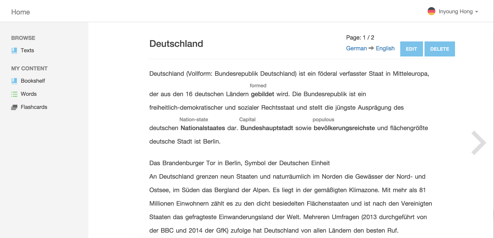
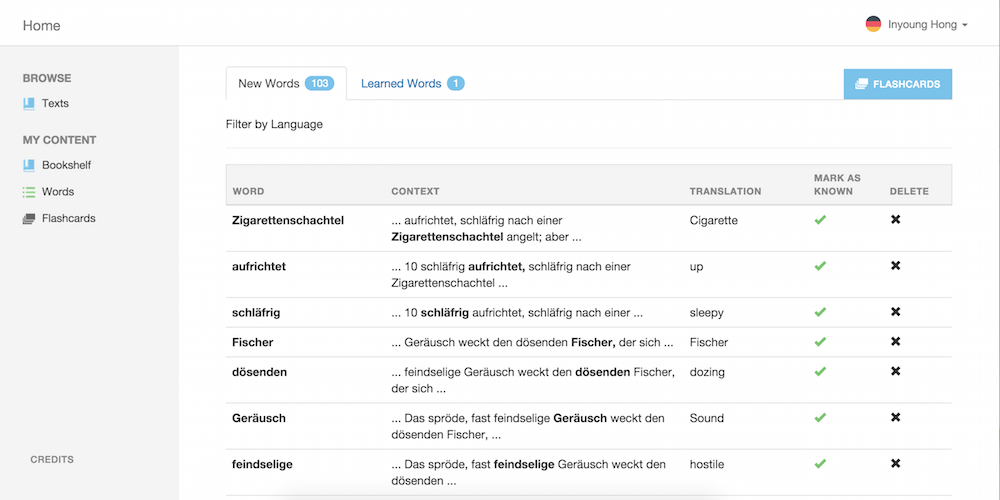
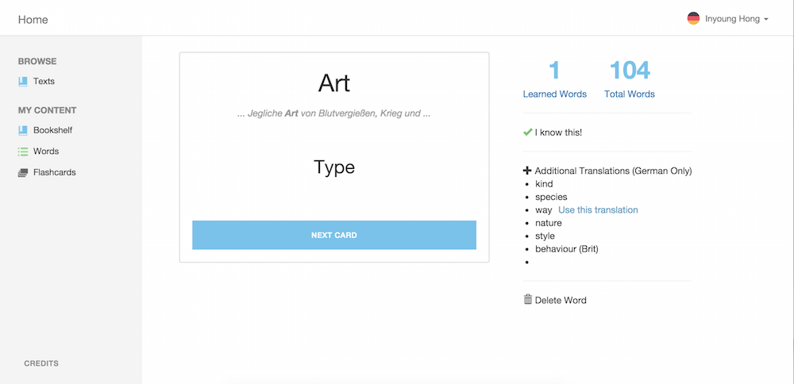

# Translation App
A translation app made from Meteor.js. Read about the project <a href="http://www.inyoung.me/#!/projects/language-learning"> here</a>.

<h2>Features</h2>
<ul>
  <li>Users can register on the site or login through Facebook</li>
  <li>Users can upload their own texts to read or browse through all uploaded texts on the site</li>
  <li>Clicking on a word displays the translation inline, creating a smooth reading experience.</li>
  <li>Users can view all the words they have ever translated, and mark words as learned.</li>
  <li>Users can test themselves on all unlearned words through flashcards.</li>
  <li>Translations can be customized for each user.</li>
  <li>Users can study more than one language at a time</li>
</ul>

<h2>Credits</h2>
Translation is provided by the Yandex Translation API.

<h2>Screenshots</h2>

